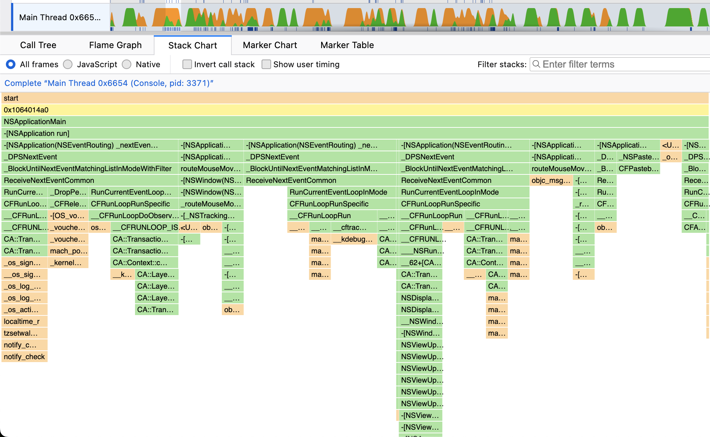

# Instruments To Gecko

Convert an Instruments file into the Gecko Profile Format for use in Firefox Profiler ([example](https://profiler.firefox.com/public/w2teve8w5fp7tmpwycwhh6etrb3kr4f1ttyfyy8/flame-graph/?globalTrackOrder=0&hiddenLocalTracksByPid=0-7&thread=0&timelineType=category&v=10)).



## Usage

```
Usage: gecko [OPTIONS]

  Convert Instruments Trace to Gecko Format (Firefox Profiler)

Options:
  -i, --input PATH          Input Instruments Trace
  --app TEXT                Name of app to match the dSyms to (e.g. YourApp)
  --run INT                 Which run within the trace file to analyze
  -o, --output PATH         Output Path for gecko profile
  -h, --help                Show this message and exit

```

**Note: XCode 14.3 Beta or higher is required**

**Example Command**

```bash

# Build executable jar
./gradlew shadowJar

# Convert Instruments trace to Gecko on the second run within the trace file
java -jar ./build/libs/instruments-to-gecko.jar --input example.trace --run 2 --app YourApp --output examplestandalone.json.gz
```
